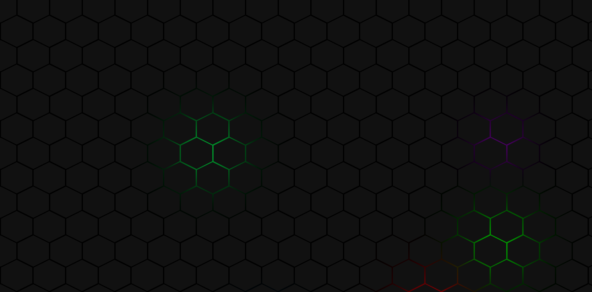

# Hexagon Live Wallpaper

	
  
  

Animated hexagon wallpaper. This can be used with Wallpaper Engine

## Credit

The idea and most of the CSS are from the video
[Hexagon Hover effect CSS3 - 2021](https://www.youtube.com/watch?v=vpxE9lh5PXA)

## Hosted version

This repository is automatically deployed to [Netlify](https://hexagon-live-wallpaper.netlify.app)

## Development server

Run `ng serve` for a dev server. Navigate to `http://localhost:4200/`. The app will automatically reload if you change any of the source files.

## Build

Run `ng build` to build the project. The build artifacts will be stored in the `dist/` directory. Use the `--prod` flag for a production build.
